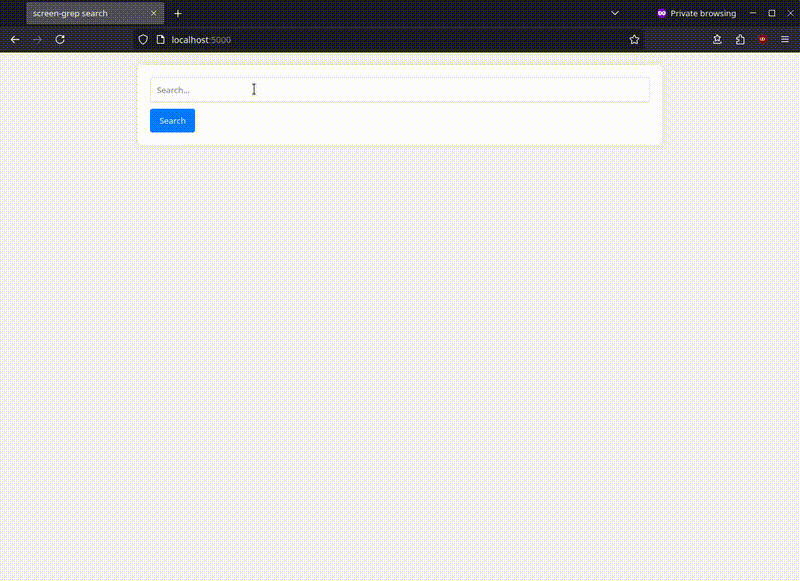
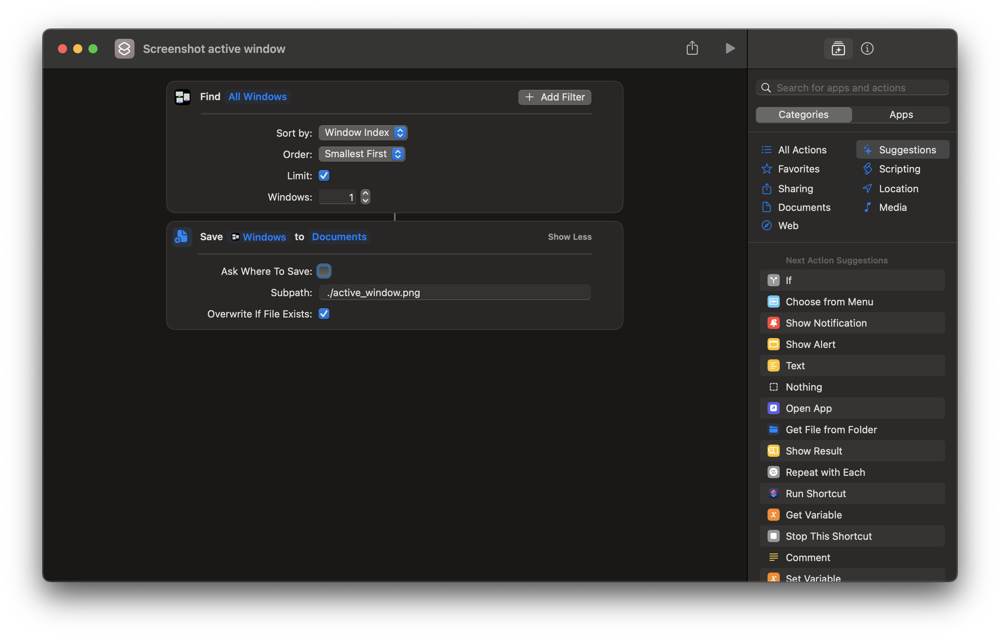
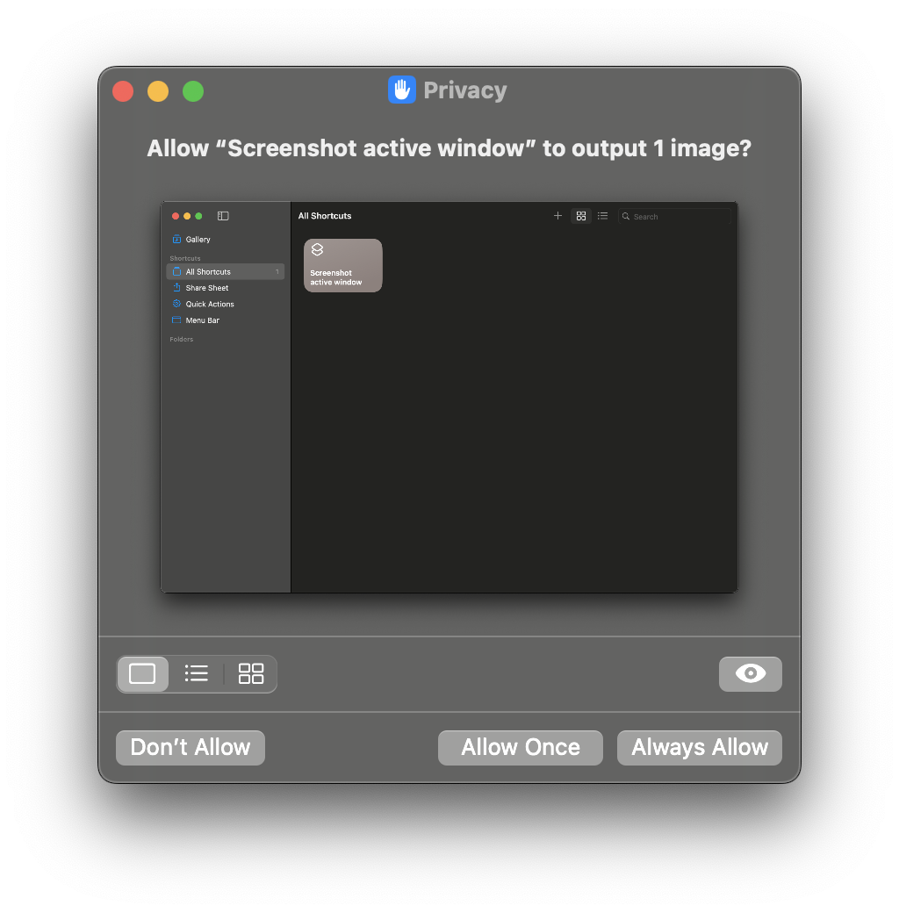

# screen-grep

A privacy-oriented, OS-agnostic, open-source alternative
to [Windows Recall](https://support.microsoft.com/en-us/windows/retrace-your-steps-with-recall-aa03f8a0-a78b-4b3e-b0a1-2eb8ac48701c),
crafted for simplicity, and centered on local data storage and model inference.

<p align="center">
  
</p>

This solution consists of the following components:

* [screenshot](src/screenshot): script that captures screenshots of your active window on a regular interval
* [caption](src/caption): run image-to-text and OCR models locally to create text captions from the screenshots
* elasticsearch: text search engine
* [search](src/search): webapp to find content from previous screenshots

## How to run

Run the screenshot capturing script:

```shell
./src/screenshot/screenshot.sh 10  # Screenshot every 10 seconds
```

Check [the "Screenshot" section](#screenshot) for support on different OSes such as [Windows](#windows)
or [macOS](#macos).

This scrip should start collecting screenshots from your active window under `data/screenshots`.

**TIP**: you can stop this script to stop capturing new screenshots while still running the search service.

Next, run the search app:

```shell
docker compose up -d
```

You can search for previous screenshots in http://localhost:5000/

**Note**: by default, docker compose will look for screenshots under `./data/screenshots/`, if your screenshot script is
running in a separate location, define the `SCREENSHOTS` environment variable before running compose:

```shell
export SCREENSHOTS=/path/to/data/screenshots
```

## Minimum Requirements

The default image-to-text model, [microsoft/Florence-2-large](https://huggingface.co/microsoft/Florence-2-large),
requires at least 16GB of RAM for inference. If you have less available memory, consider using a smaller variant, such
as [microsoft/Florence-2-base](https://huggingface.co/microsoft/Florence-2-base), which only needs 8GB. To use this
variant, replace [this line](src/caption/image2text.py#L95) with `microsoft/Florence-2-base`.

## Local development setup

Run the screenshot capturing script:

```shell
./src/screenshot/screenshot.sh
```

Run an [elasticsearch](https://www.elastic.co/elasticsearch) container in docker to store processed captions:

```shell
docker run --rm -it -e discovery.type=single-node -p 9200:9200 docker.elastic.co/elasticsearch/elasticsearch:7.10.1
```

Run the service that generates captions from the screenshots and stores them in the search index:

```shell
pip install -r src/caption/requirements.txt
export HF_HOME=data/models  # Optionally store huggingface cache in current dir
python src/caption/main.py
```

Start the [webapp](http://127.0.0.1:5000) that searches for previous screenshots:

```shell
pip install -r src/search/requirements.txt
python src/search/app.py
```

# Screenshot

Support for this component throughout different OSes is still a work in progress. 

### Linux

The [`screenshot.sh` script](src/screenshot/screenshot.sh) supports a variety of different environments:

- For [KDE Plasma](https://kde.org/plasma-desktop/), the script utilizes the `spectacle` app CLI, so please ensure it is
  installed.
- In other [X11](https://en.wikipedia.org/wiki/X_Window_System) window sessions, you need to have `imagemagick`
  and `xdottool` installed on your system.
- For [Wayland](https://wayland.freedesktop.org/) support, the script uses `grim`, `swaymsg`, and `jq`.

### Windows

To capture screenshots in Windows, use [this PowerShell script](src/screenshot/screenshot.ps1). In order to run it, you
should change the default PowerShell's execution policy, which restricts the running of scripts for security reasons:

1. Search for "PowerShell" in the Start menu.
2. Right-click on "Windows PowerShell" and select "Run as administrator."
3. Run the following command to set the execution policy to allow running scripts:
    ```shell
    Set-ExecutionPolicy -ExecutionPolicy RemoteSigned
    ```

Once the policy is set, right-click on the [PowerShell script](src/screenshot/screenshot.ps1) and select
"Run with PowerShell".

### macOS

By default, the [`screenshot.sh` script](src/screenshot/screenshot.sh) takes a screenshot of the entire screen on macOS
using `screencapture -x`. To take a screenshot of only the active window, create a special shortcut with
the [Shortcuts app](https://support.apple.com/guide/shortcuts-mac/intro-to-shortcuts-apdf22b0444c/mac). Follow these
steps:

1. Open the Shortcuts app and create a new shortcut
2. Use the "Find Windows" action, set the following options to "Find `All Windows`":
    - Sort by: Window Index
    - Order: Smallest First
    - Limit: Checked
    - Windows: 1
3. Use the "Save File" action, set the following options to "Save `Windows` to `Documents`":
    - Ask Where To Save: Unchecked (then select the `Documents` directory instead of `Shortcuts`)
    - Subpath: `./active_window.png`
    - Overwrite If File Exists: Checked
4. Name your shortcut: "Screenshot active window"

Your custom Shortcut should look like this:

<p align="center">
  
</p>

When a shortcut named "Screenshot active window" is present, the script will use it instead of `screencapture`. The
first time you run it, it will request user authorization. Select "Always Allow":

<p align="center">
  
</p>

# Roadmap of features

- [ ] Regex to isolate hyperlinks from screenshots
- [ ] Option to remove specific screenshots
- [ ] Option to remove history
- [ ] Expand Linux screenshot support
- [x] Windows screenshot support
- [x] macOS screenshot support
- [ ] Simplify and move the screenshot script to docker
- [ ] Improve search algorithm (use embeddings combined with fuzzy search)
- [ ] Add LLM chat support (eg: be able to ask "how much time have I been working on my IDE today?")
